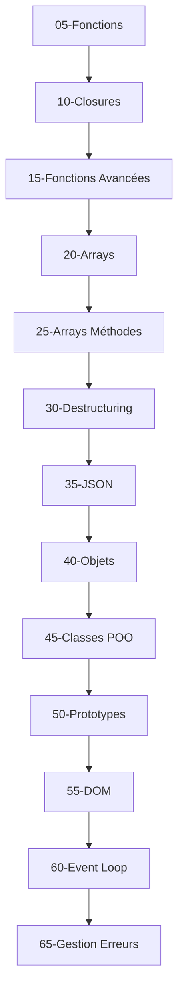

# 🟡 Niveau Intermédiaire - Organisation des Cours

## 📚 Structure pédagogique

Les cours du niveau intermédiaire sont organisés avec une **progression logique** et une **numérotation par incréments de 5** pour faciliter l'ajout de nouveaux contenus.

## 📖 Ordre des cours

| N° | Fichier | Titre | Durée | Concepts clés |
|----|---------|-------|-------|---------------|
| **05** | `05-fonctions.md` | ⚡ Fonctions | 60 min | Déclaration, paramètres, return |
| **10** | `10-closures-lexical-scope.md` | 🧠 Closures et Lexical Scope | 45 min | Portée, closures, contexte |
| **15** | `15-fonctions-avancees.md` | 🚀 Fonctions Avancées | 50 min | Arrow functions, callbacks, this |
| **20** | `20-arrays.md` | 📋 Arrays (Tableaux) | 120 min | Création, manipulation, méthodes de base |
| **25** | `25-arrays-methodes-avancees.md` | 🔄 Arrays et Méthodes Avancées | 90 min | map, filter, reduce, forEach |
| **30** | `30-destructuring-spread.md` | 📦 Destructuring et Spread | 60 min | Décomposition, spread operator |
| **35** | `35-json-manipulation.md` | 📄 JSON et Manipulation | 45 min | Parse, stringify, APIs |
| **40** | `40-objets.md` | 🏗️ Objets JavaScript | 75 min | Propriétés, méthodes, manipulation |
| **45** | `45-classes-poo.md` | 🎭 Classes et POO | 90 min | ES6 classes, encapsulation, héritage |
| **50** | `50-prototypes-heritage.md` | 🧬 Prototypes et Héritage | 60 min | Chaîne prototypale, Object.create |
| **55** | `55-dom-manipulation.md` | 🌐 DOM et Manipulation | 100 min | Sélection, modification, événements |
| **60** | `60-event-loop-asynchrone-base.md` | ⏰ Event Loop et Asynchrone | 40 min | setTimeout, callbacks, non-bloquant |
| **65** | `65-gestion-erreurs.md` | 🚨 Gestion d'Erreurs | 45 min | try/catch/finally, erreurs custom |

## 🎯 Prérequis et progression

### Prérequis niveau débutant
Avant de commencer ce niveau, vous devez maîtriser :
- ✅ Variables et types de données
- ✅ Structures de contrôle (if/else, boucles)
- ✅ Opérateurs et comparaisons

### Progression recommandée
1. **Fonctions** (05-15) - Base de la programmation modulaire
2. **Structures de données** (20-35) - Arrays et objets
3. **Programmation orientée objet** (40-50) - Classes et prototypes  
4. **Interaction** (55-65) - DOM et gestion asynchrone

## 🔄 Liens entre les concepts

## 📊 Répartition par thème

### 🔧 **Fonctions** (05-15)
- Syntaxe et concepts de base
- Closures et portée
- Techniques avancées

### 📊 **Données** (20-35)
- Arrays et manipulation
- Destructuring et spread
- JSON et APIs

### 🏗️ **Objets** (40-50)
- Objets littéraux
- Classes ES6 et POO
- Prototypes et héritage

### 🌐 **Interaction** (55-65)
- Manipulation du DOM
- Programmation asynchrone
- Gestion robuste des erreurs

## 🎯 Objectifs d'apprentissage

À la fin du niveau intermédiaire, vous serez capable de :

- ✅ **Créer des fonctions** complexes avec closures et callbacks
- ✅ **Manipuler des arrays** avec les méthodes modernes (map, filter, reduce)
- ✅ **Structurer des données** avec objets et classes
- ✅ **Interagir avec le DOM** de manière dynamique
- ✅ **Gérer l'asynchrone** avec setTimeout et callbacks
- ✅ **Déboguer efficacement** avec une gestion d'erreurs robuste

## 🚀 Prochaine étape

Une fois ce niveau maîtrisé, vous pouvez progresser vers le **[Niveau Avancé](../niveau-avance/)** qui couvre :
- Programmation asynchrone avancée (Promises, async/await)
- Modules et organisation du code
- TypeScript et outils modernes
- Performance et optimisation

---

*📅 Dernière mise à jour : 18/07/2025*  
*🎓 Niveau : Intermédiaire*  
*⏱️ Durée totale estimée : ~13 heures*
