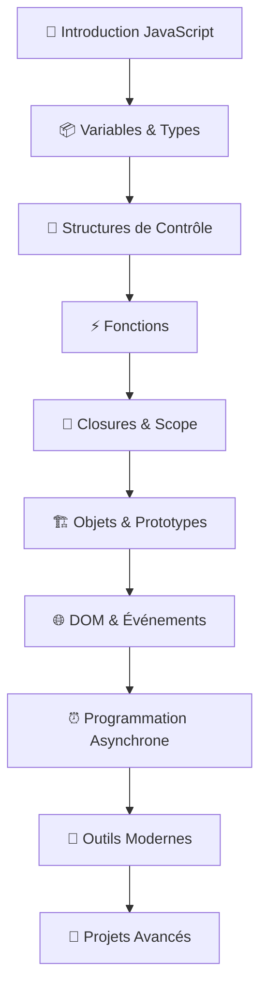

# 🚀 Cours JavaScript Complet - De Zéro à Expert


**Bienvenue dans le cours JavaScript le plus complet en français !**

Ce guide vous accompagne de débutant absolu à développeur JavaScript expert, avec une progression logique et des projets pratiques.


## 🎯 **À qui s'adresse ce cours ?**



**Vous débutez en programmation ?**
- ✅ Aucune connaissance préalable requise
- ✅ Explications depuis les bases
- ✅ Progression douce et guidée
- ✅ Projets adaptés aux débutants

**Commencez par :** [Introduction JavaScript](niveau-debutant/introduction-javascript.md)



**Vous connaissez les bases ?**
- ✅ Variables, fonctions, boucles maîtrisées
- ✅ Prêt pour les concepts avancés
- ✅ Closures, prototypes, asynchrone
- ✅ Projets web interactifs

**Dirigez-vous vers :** [Closures et Scope](niveau-intermediaire/closures-lexical-scope.md)



**Vous voulez devenir expert ?**
- ✅ Concepts JavaScript maîtrisés
- ✅ Performance et optimisation
- ✅ Outils modernes (Vite, NPM)
- ✅ Architecture d'applications

**Explorez :** [Vite et Build Moderne](niveau-avance/vite-modern-bundling.md)



## 📊 **Progression du cours**


**État actuel du cours :**

**✅ Fondations solides (100%)** - Tous les concepts de base couverts
**🔄 Niveau intermédiaire (80%)** - Quasi-complet, quelques ajouts prévus  
**🚧 Niveau avancé (40%)** - En développement actif
**📋 Spécialisations (20%)** - Domaines métier spécifiques

**Total : 161 fiches planifiées | 136 fiches disponibles**


## 🗺️ **Roadmap d'apprentissage**

## 🎓 **Méthode pédagogique**


**Notre approche unique :**

🎯 **Apprentissage par la pratique** - 70% code, 30% théorie  
🧩 **Concepts connectés** - Chaque leçon prépare la suivante  
🔍 **Debugging intégré** - Apprenez à résoudre les erreurs  
🚀 **Projets concrets** - Applications utilisables en portfolio  


## 📚 **Contenu du cours**

### 🟢 **Niveau Débutant** (12 chapitres)
- [🚀 Introduction à JavaScript](niveau-debutant/introduction-javascript.md)
- [📜 Histoire et Versions ES5/ES6+](niveau-debutant/histoire-versions-javascript.md) ⭐ *Nouveau*
- [📦 Variables et Déclarations](niveau-debutant/variables-declarations.md)
- [🔄 Hoisting et Portée](niveau-debutant/hoisting-portee.md)
- [🏷️ Types de Données](niveau-debutant/types-donnees.md)
- [⚖️ Comparaisons et Égalité](niveau-debutant/comparaisons-egalite.md)
- [🧮 Opérateurs Logiques](niveau-debutant/operateurs-logiques.md)
- [🔀 Structures de Contrôle](niveau-debutant/structures-controle.md)
- [❓ Opérateur Ternaire](niveau-debutant/operateur-ternaire.md) ⭐ *Nouveau*
- [🔄 Boucles et Algorithmes](niveau-debutant/operateurs-boucles.md)

### 🟡 **Niveau Intermédiaire** (15 chapitres)
- [⚡ Fonctions](niveau-intermediaire/fonctions.md)
- [🧠 Closures et Lexical Scope](niveau-intermediaire/closures-lexical-scope.md) ⭐ *Nouveau*
- [🚀 Fonctions Avancées](niveau-intermediaire/fonctions-avancees.md)
- [📋 Destructuring et Spread](niveau-intermediaire/destructuring-spread.md)
- [📄 JSON et Manipulation](niveau-intermediaire/json-manipulation.md) ⭐ *Nouveau*
- [📊 Arrays et Méthodes](niveau-intermediaire/arrays.md)
- [🔄 Méthodes d'Itération](niveau-intermediaire/arrays-methodes-iteration.md)
- [🏗️ Objets JavaScript](niveau-intermediaire/objets.md)
- [🎭 Classes et POO](niveau-intermediaire/classes-poo.md)
- [🧬 Prototypes et Héritage](niveau-intermediaire/prototypes-heritage.md) ⭐ *Nouveau*
- [🌐 DOM et Manipulation](niveau-intermediaire/dom-manipulation.md)
- [⏰ Event Loop et Asynchrone](niveau-intermediaire/event-loop-asynchrone.md) ⭐ *Nouveau*
- [🚨 Gestion d'Erreurs](niveau-intermediaire/gestion-erreurs.md)

### 🔴 **Niveau Avancé** (25+ chapitres)
- [⏳ Programmation Asynchrone](niveau-avance/programmation-asynchrone.md)
- [🚨 Gestion d'Erreurs Avancée](niveau-avance/gestion-erreurs-avancee.md)
- [📦 Modules et Organisation](niveau-avance/modules-organisation.md)
- [📘 TypeScript Introduction](niveau-avance/typescript-introduction.md)
- [🌐 APIs du Navigateur](niveau-avance/apis-navigateur.md)
- [🔥 Vite et Build Moderne](niveau-avance/vite-modern-bundling.md) ⭐ *Nouveau*
- [📦 NPM/Yarn Gestion Dépendances](niveau-avance/npm-yarn-dependency-management.md) ⭐ *Nouveau*
- [🔌 WebSockets et Socket.IO](niveau-avance/websockets-socket-io.md) ⭐ *Nouveau*
- [🧪 Testing JavaScript](niveau-avance/testing-javascript.md)
- [⚡ Optimisation Performance](niveau-avance/optimisation-performance.md)
- [🛡️ Sécurité et Bonnes Pratiques](niveau-avance/security-best-practices.md)

## 🛠️ **Projets Pratiques**


[projets-pratiques](projets-pratiques/)


### 🎯 **Projets par niveau**



- **Calculatrice Interactive** - DOM, événements, calculs
- **Todo List Simple** - CRUD, localStorage
- **Jeu de Devinettes** - Logique, boucles, conditions
- **Convertisseur d'Unités** - Fonctions, validation



- **API Météo** - Fetch, JSON, promesses
- **Gestionnaire de Contacts** - OOP, prototypes
- **Chat en Temps Réel** - WebSockets, événements
- **Galerie Photos** - Async/await, APIs



- **Framework MVC Personnalisé** - Architecture, patterns
- **Bundle Analyzer** - Vite, performance
- **PWA Complète** - Service Workers, cache
- **Dashboard Analytics** - D3.js, visualisation



## 🎓 **Certification et Portfolio**


**À la fin du cours, vous aurez :**

✅ **15+ projets** dans votre portfolio GitHub  
✅ **Maîtrise complète** de JavaScript moderne  
✅ **Compétences professionnelles** recherchées  
✅ **Bases solides** pour React, Vue, Node.js  


## 🚀 **Commencer maintenant**


**Prêt à devenir un expert JavaScript ?**

👉 **Débutant complet :** [Commencez ici](niveau-debutant/introduction-javascript.md)  
👉 **Quelques bases :** [Testez vos connaissances](evaluation/quiz-niveau.md)  
👉 **Développeur expérimenté :** [Niveau avancé](niveau-avance/)  


---

## 📞 **Support et Communauté**

- 💬 **Discord** : [Rejoindre la communauté](https://discord.gg/javascript-fr)
- 🐛 **Issues** : [Signaler un problème](https://github.com/javascript-course/issues)
- 📧 **Contact** : cours@javascript-expert.fr


**Ce cours est maintenu activement !**

Dernière mise à jour : 18 juillet 2025  
Prochaine version : Août 2025 (Node.js, Express, React)

